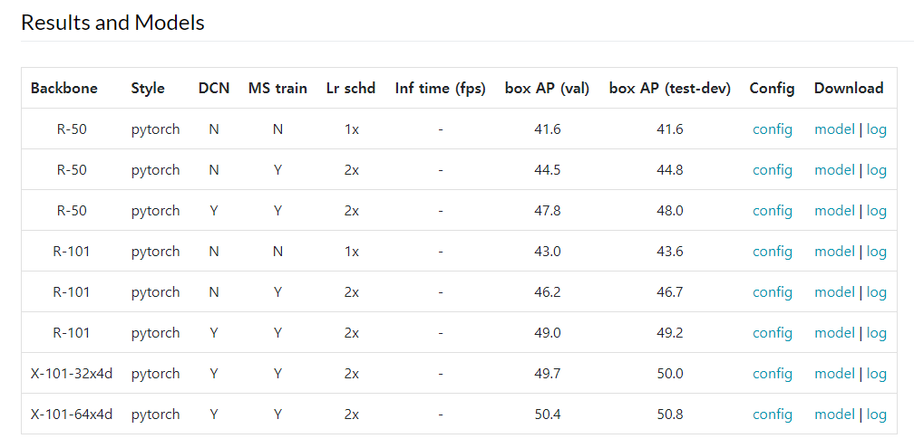
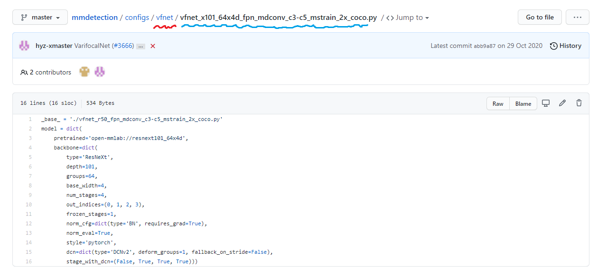
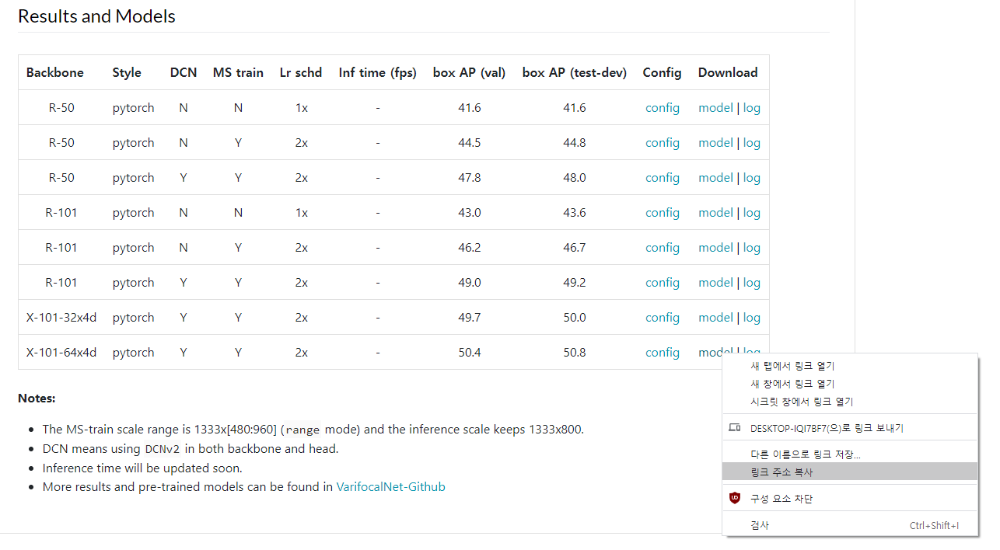

# 사용법

## mmdet_config.ipynb

가장 먼저 `model_name` / `model_cfg` / `model_url` 을 지정해줍니다.

`model_name`은 configs 폴더에서 해당 모델 config이 있는 모델 이름,

`model_cfg`는 configs/{model_name} 폴더 내에 있는 해당 config 파일의 이름 입니다.

`model_url`은 model checkpoint가 저장된 경로로 config.py 파일 내에 load_from으로 지정이 된다고 생각하시면 됩니다.

예를 들어, VFNet을 사용하려고 https://paperswithcode.com/lib/mmdetection/vfnet에서 X-101-64x4d 모델을 가져온다고 합시다.

해당 config을 클릭해서 해당 모델의 config 파일 이름이 뭔지 확인합니다. (VFNet은 Config 링크가 잘못되어 있어서 오류가 있네요. https://github.com/open-mmlab/mmdetection/blob/master/configs/vfnet_x101_64x4d_fpn_mdconv_c3-c5_mstrain_2x_coco.py <- 이걸 쓰세요)

보시면 빨간 밑줄이 `model_name`, 파란 밑줄(.py 빼고)이 `model_cfg`로 사용하시면 됩니다!

`model_url`의 경우는 아래 사진처럼 모델 리스트 사진에서 model 링크를 우클릭한 뒤에 `model_url`에 붙여 넣어주시면 됩니다.

추가로 이렇게 입력된 model_url 파일은 직접 config 파일에 넣어서 사용하게 되면 가끔 오류를 발생해서 가급적이면 로컬로 받아서 사용하는게 좋습니다. 그래서 mmdet_get_config.ipynb 마지막 셀에 해당 파일을 직접 받아서 pretrained 폴더에 저장하게 한 뒤에 `load_from`인자가 해당 파일을 가리키도록 설정해놔서 혹시라도 사용하다가 서버의 용량이 부족하면 해당 폴더에서 사용하지 않는 pretrained 모델을 지우시면 됩니다.

이렇게 세팅한 뒤에 mmdet_get_config.ipynb 노트북 파일을 실행시키면 custom_configs 폴더에 해당 모델의 config 파일이, pretrained 폴더에는 해당 모델의 checkpoint 파일(.pth)이 생성됩니다.

## mmdet_train.ipynb

이 부분은 custom_configs 폴더에 있는 학습 시키고자 하는 모델의 config 파일 이름을 `model_cfg`에 넣어주는 것 외에는 별다른 작업 없이 그냥 실행시키시면 됩니다. 다만 mmdet_get_config.ipynb의 기본 세팅 중에 wandb에 로그가 남도록 세팅해놨기 때문에 wandb을 사용하지 않으시면 그 부분을 수정하시고 사용하시면 됩니다!

학습을 하면서 생기는 모델 파일이나 log, best_mAP_50.pth 같은 기록은 save_dir 폴더에 해당 config 파일의 이름으로 생성된 폴더에 저장됩니다.

## mmdet_inference.ipynb

이 부분도 mmdet_train.ipynb와 동일하게 save_dir에 있는 실행시키고자 하는 모델의 폴더 명을 `model_cfg`에 넣어주신 다음에 실행시키시면 됩니다. 기존의 config의 기본 세팅이 test inference 시에 5개의 멀티스케일로 inference가 되도록 설정되어 있어서 생각보다 inference하는데 오랜 시간이 걸리는 것만 주의하시면 될 것 같습니다.

참고로 해당 submission 파일은 save_dir에 해당 모델 폴더 내에 `submission_{model_cfg}.csv`로 저장됩니다.

## mmdet_ensemble.ipynb

학습한 모델들의 기록을 가지고 weighted boxes fusion ensemble하는 파일 입니다. 앙상블 하고자 하는 모델의 csv 파일을 save_dir 내에 `Weighted_Boxes_Fusion` 폴더에 넣으신 뒤에 save_paths의 원소로 해당 파일명을 입력해주시면 됩니다.

추가로 lb_scores는 각 csv 파일에 해당하는 가중치로 저의 경우 해당 csv 파일의 리더보드 스코어 순으로 n, n-1, n-2, ... , 1로 세팅했습니다.

실행시키고 나면 save_dir/Weighted_Boxes_Fusion 폴더 내에 `submission_wbf_ensemble.csv` 파일이 생성되고 그 파일을 제출하시면 됩니다!